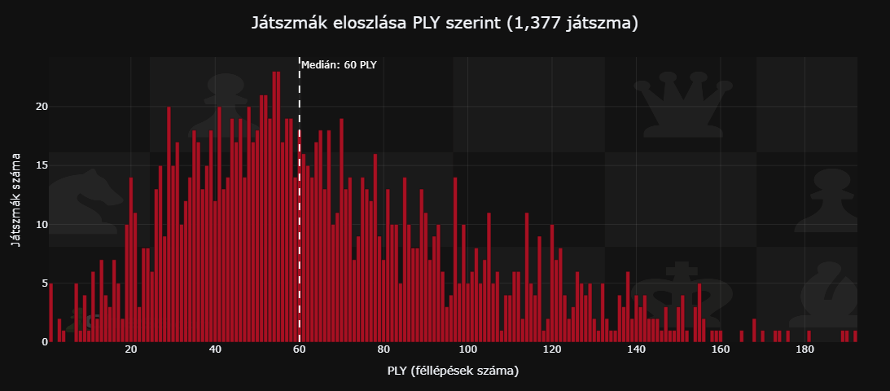

# Chess PGN Analysis & Narration



Sakkjátszmák elemzésére, LLM-alapú narrációgenerálásra és interaktív lejátszásra épített pipeline, jelenleg még csak lokálisan futtatható!

**Ellenőrizd, hogy a stockfish benne van-e a gyökérkönyvtárban, ha nincs, manuálisan innen letölthető, főkönyvtárba kicsomagolandó: https://github.com/official-stockfish/Stockfish/releases/latest/download/stockfish-windows-x86-64-avx2.zip**

---

## Funkciók

- **Saját PGN feltöltése** – bármilyen sakkjátszmát beilleszthetsz, a pipeline azonnal feldolgozza
- **Stockfish elemzés** – lépésenkénti pozícióértékelés, hibák és brilliáns lépések detektálása
- **LLM narráció** – a játszma szöveges elemzése OpenAI / Gemini / Anthropic / Mistral segítségével
- **TTS hangosítás** – a narráció felolvasása OpenAI TTS vagy ElevenLabs hanggal
- **Interaktív sakktábla lejátszó** – a narráció hangjával szinkronizált táblaállapot-váltás
> Fejlesztés alatt: **Lichess bulk elemzés** – nagy (akár 31 GB+) PGN fájlok párhuzamos feldolgozása

---

## Projekt struktúra

```
chess-pgn-analysis/
├── streamlit_app.py          # Streamlit dashboard (fő belépési pont)
├── config.py                 # Központi konfiguráció és env változók
├── secrets.example.py        # API kulcs sablon (ezt másold le secrets.py-ként)
├── packages.txt              # Streamlit Cloud rendszercsomagok (stockfish)
├── requirements.txt          # Python függőségek
└── src/
    ├── 01_pgn_to_parquet.py  # PGN → Parquet konverzió (multiprocessing)
    ├── 02_analysis.py        # DuckDB/Polars statisztikák
    ├── 03_stockfish_analysis.py  # Stockfish motor elemzés
    ├── 04_tts.py             # TTS pipeline futtatása
    ├── llm_client.py         # LLM provider absztrakció
    ├── tts_client.py         # TTS provider absztrakció
    └── run_pipeline.py       # Teljes pipeline egy lépésben
```

---

## Gyors indítás (lokálisan)

### 1. Függőségek

```bash
pip install -r requirements.txt
```

Stockfish telepítése (ha nincs):
- **Windows:** a pipeline automatikusan letölti az első futáskor
- **Linux/macOS:** `sudo apt install stockfish` vagy `brew install stockfish`

### 2. PGN előkészítés és pipeline futtatása

A notebookok és a Streamlit app előtt a `run_pipeline.py`-t kell futtatni egyszer – ez generálja az összes szükséges kimeneti fájlt (Parquet, JSON-ok). **A notebookok ezt automatikusan elvégzik, ha a fájlok még nem léteznek** – de kézzel is indítható:

```bash
python src/run_pipeline.py --pgn sajat_jatszmaim.pgn
```

Hasznos kapcsolók:
```bash
# Teszteléshez: csak az első 1000 játszma
python src/run_pipeline.py --pgn sajat_jatszmaim.pgn --max-games 1000

# Ha a Parquet már megvan, kihagyja a konverziót
python src/run_pipeline.py --pgn sajat_jatszmaim.pgn --skip-conversion

# Stockfish nélkül (gyorsabb)
python src/run_pipeline.py --pgn sajat_jatszmaim.pgn --skip-stockfish
```

### 3. API kulcsok

Másold le a sablont és töltsd ki:

```bash
cp secrets.example.py secrets.py
```

A `secrets.py` tartalma:

```python
CHAT_GPT_API_KEY   = "..."   # platform.openai.com/api-keys
GEMINI_API_KEY     = "..."   # aistudio.google.com/apikey
ANTHROPIC_API_KEY  = "..."   # console.anthropic.com/settings/keys
MISTRAL_API_KEY    = "..."   # console.mistral.ai/api-keys
ELEVENLABS_API_KEY = "..."   # elevenlabs.io/app/settings/api-keys
```

Elég csak azokat kitölteni, amelyeket használni szeretnél.

### 3. Streamlit indítása

```bash
streamlit run streamlit_app.py
```

---

## Streamlit Community Cloud deploy

**TODOs**: Ahhoz, hogy streamlitre deployolható legyen továbbfejlesztést igényel! Még nem működik deployolva a Stockfish!

1. Fork-old vagy push-old a repót GitHubra
2. [share.streamlit.io](https://share.streamlit.io) → New app → válaszd ki a repót, main fájl: `streamlit_app.py`
3. **Secrets** mezőbe add meg az API kulcsokat TOML formátumban:

```toml
GEMINI_API_KEY     = "..."
CHAT_GPT_API_KEY   = "..."
ELEVENLABS_API_KEY = "..."
```

A `packages.txt` automatikusan telepíti a Stockfish-t a Cloud-on (`apt install stockfish`).

---

## LLM és TTS provider váltás

A `config.py`-ban (vagy env változóval) állítható:

| Változó | Lehetséges értékek | Alapértelmezett |
|---|---|---|
| `LLM_PROVIDER` | `openai` \| `gemini` \| `anthropic` \| `mistral` | `openai` |
| `TTS_PROVIDER` | `openai` \| `elevenlabs` | `openai` |
| `LLM_MODEL` | pl. `gpt-4o`, `gemini-2.0-flash-lite` | provider alapértelmezése |

---

## Lichess bulk pipeline (CLI)

Nagy PGN fájlok feldolgozásához (pl. havi Lichess dump):

```bash
# Teljes pipeline
python src/run_pipeline.py --pgn lichess_db_2024-01.pgn

# Csak konverzió, elemzés kihagyásával
python src/run_pipeline.py --pgn lichess_db_2024-01.pgn --skip-stockfish

# Lépésenként
python src/01_pgn_to_parquet.py --pgn lichess_db_2024-01.pgn --workers 8
python src/02_analysis.py
python src/03_stockfish_analysis.py
```

---

## Technológiai stack

| Eszköz | Szerepe |
|---|---|
| `streamlit` | Webes dashboard |
| `python-chess` | PGN beolvasás, táblaállapot, SVG megjelenítés |
| `stockfish` | Sakkmotor elemzés (lépésenkénti értékelés) |
| `openai` / `google-generativeai` | LLM narráció |
| `elevenlabs` | TTS hangosítás |
| `polars` | Nagy adathalmazok elemzése (LazyFrame) |
| `duckdb` | SQL lekérdezések Parquet felett |
| `pyarrow` / `parquet` | Hatékony adattárolás |
| `plotly` | Interaktív vizualizációk |
| `multiprocessing` | Párhuzamos PGN feldolgozás |

---

## Megjegyzések

- A `secrets.py` fájl nincs és ne kerüljön verziókövetésbe (`.gitignore`-ban van)
- A DuckDB lekérdezőmotorként üzemel – nem hoz létre tartós `.duckdb` fájlt
- A pipeline **bármilyen méretű PGN fájlra** működik, nem csak Lichess-re
- Lichess havi dumpok: [database.lichess.org](https://database.lichess.org)
